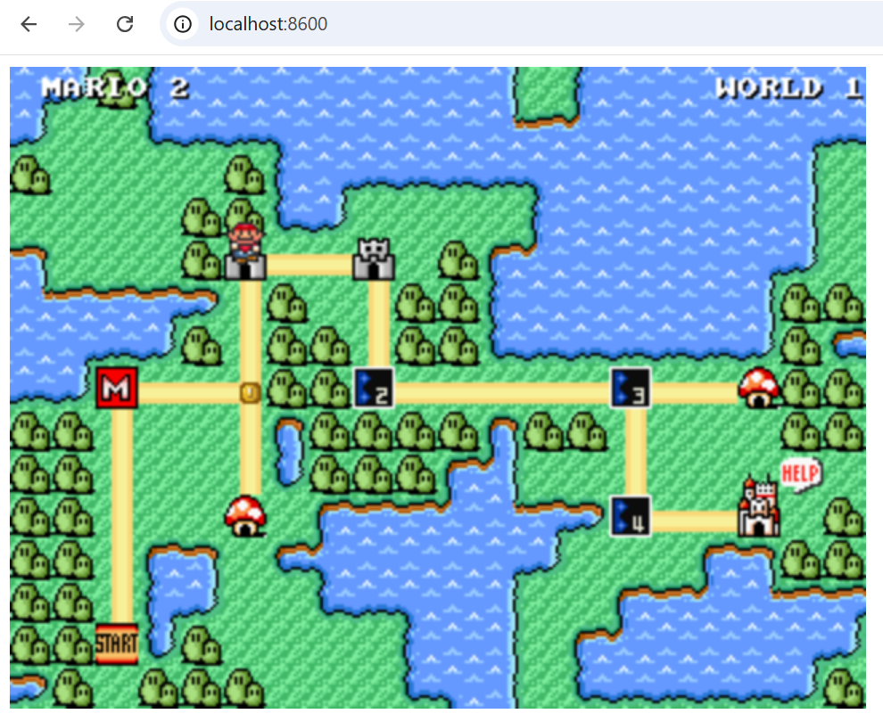

# Dossier Images et Utilisation de Docker

Ce dossier contient plusieurs images liées à des jeux vidéo, notamment l'univers de Mario.  
Nous allons également voir comment utiliser Docker pour exécuter le jeu Super Mario dans un conteneur.


```docker
docker search pengbai/supermario
```

### Pengbai Mario


```docker
docker pull pengbai/docker-supermario
```
```docker
docker run -d --name supermario -p 8600:8080 pengbai/docker-supermario
```
```docker
docker run -d --name supermario2 -p 8700:8080 pengbai/docker-supermario
```
### Docker Super Mario


### Infinite Mario


### Mario Game


### Nouveau Jeu


### Niveau 1


### Play Game


## Différentes utilisations de Docker (Terminal/Desktop)

Pour chaque cas, nous allons voir comment résoudre le problème en utilisant le terminal et Docker Desktop.

### Arrêter un conteneur :

- **Avec le terminal** :  
  ```docker
  docker stop <nom_du_conteneur>

### Avec Docker Desktop :
Allez dans le menu "Containers" et, dans la section "Actions", cliquez sur l'icône de la corbeille pour supprimer le conteneur.

### Supprimer une image :
- **Avec le terminal** :
```docker
docker rmi <nom_de_l_image>
```

- **Avec Docker Desktop** :
Allez dans le menu "Images" et, dans la section "Actions", cliquez sur l'icône de la corbeille pour supprimer l’image.

