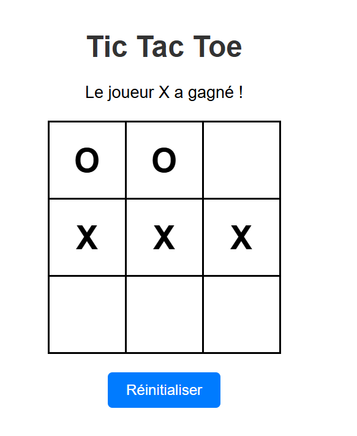
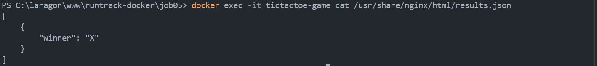
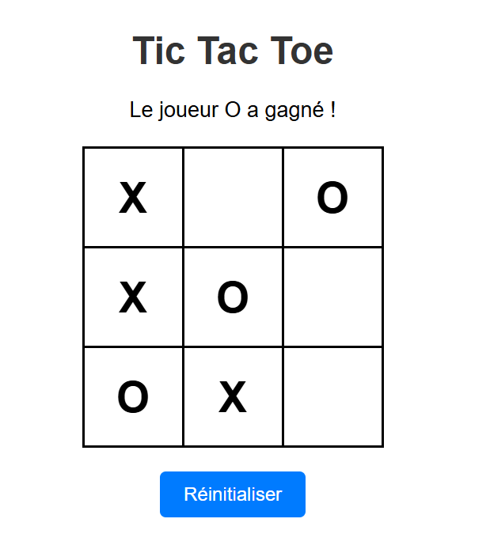

``` docker
docker volume create game-results
```
``` docker
docker build -t tic-tac-toe .
```
``` docker
docker run -d -p 8080:80 -v game-results:/usr/share/nginx/html --name tictactoe-game tic-tac-toe
```




